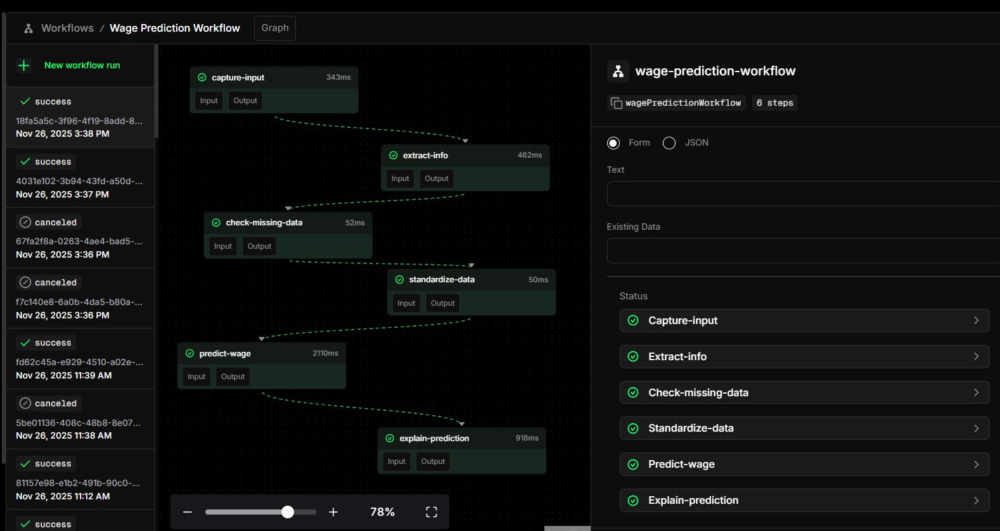

# Wage Prediction Workflow — Design Overview

## 1. Goal
Translate the original `wage.service.ts` into a Mastra workflow using clear, modular steps.  
The focus was on:  
- A structured, step-based pipeline  
- Reliable field extraction  
- Friendly frontend states so frontend can react accordingly (`success`, `need_more_info`, `error`)  
- Space for creative additions where time allowed  

---

## 2. Workflow Structure
The workflow follows a simple but robust pipeline:

### **Step 1 — Capture Input**
Takes raw user text. In the final version this step also detects the user’s language and translates non-English input to English.

### **Step 2 — Extract Data**
Uses the extraction agent to convert text into normalized buckets (age, experience, education, gender, country, industry).  
It merges this with any previously collected data so the system can build a complete profile over multiple user messages.

### **Step 3 — Check Missing Data**
Determines whether all required fields are present.  
- If not → returns `need_more_info` and generates the next question for the user.  
- If yes → proceeds to the prediction step.

### **Step 3.5 — Standardize Data**
Ensures the extracted fields are clean, consistent, and aligned with the prediction API requirements.

### **Step 4 — Predict Wage**
Sends the cleaned data to the external API and returns the prediction.  
If the user’s language wasn’t English, the final wage message is translated back into their native language.

### **Step 5 — Explain Prediction (Fun Add-On)**
Generates a short explanation of *why* the predicted wage makes sense and lists key influencing factors.  
This explanation is also translated back to the user’s preferred language.

---

## 3. Two-Agent Architecture
To keep responsibilities clean and prevent prompt overlap, the workflow uses two dedicated agents:

### **wageExtractorAgent**
- Extracts structured fields  
- Normalizes values into defined buckets  
- Merges new and existing user data  

### **translatorAgent**
- Detects the user’s ISO-639 language  
- Translates user input → English  
- Translates final results → user’s language  
- Uses Groq’s lightweight 8B model for fast translation  

---

## 4. “Fun Additions”
The brief encouraged exploring extra ideas if time allowed, so I added two user-focused enhancements:

### **1. Full Multi-Language Support**
The workflow can be used entirely in the user’s native language.  
Internally, all extraction and prediction logic stays in English for consistency.

### **2. Prediction Explanation**
Beyond returning a number, the system explains:  
- Why the predicted wage makes sense  
- Which factors influenced the result  
- A short, clear 2–3 sentence summary  

These features improve accessibility and overall user experience.

---

## 5. Reliability Measures
To make the workflow production-friendly and robust:

- **Zod schemas** validate and sanitize model outputs  
- **Fallback parsing** for malformed JSON  
- **Data standardization** before API calls  
- Graceful `need_more_info` and `error` states  
- Clear separation of responsibilities through steps and agents  

---

## 6. Reflection
The final Mastra workflow transforms the original backend logic into a modular, multi-language, user-friendly system.  
It guides users through missing fields conversationally, ensures consistent data for the prediction API, and adds extra value through translation and explanations.

---

## 7. Reflection
I had a ton of fun working with Mastra and exploring what was possible beyond the original backend implementation.  
The workflow system made it surprisingly easy to experiment with new ideas like multilingual support and prediction explanations, and it helped me think more clearly about how to structure LLM pipelines.

Unfortunately, I wasn’t able to incorporate all of these workflow features into the frontend within the available time.  
Still, the process itself was a great learning experience, and I’m happy with how the workflow turned out and how extensible it already is.

